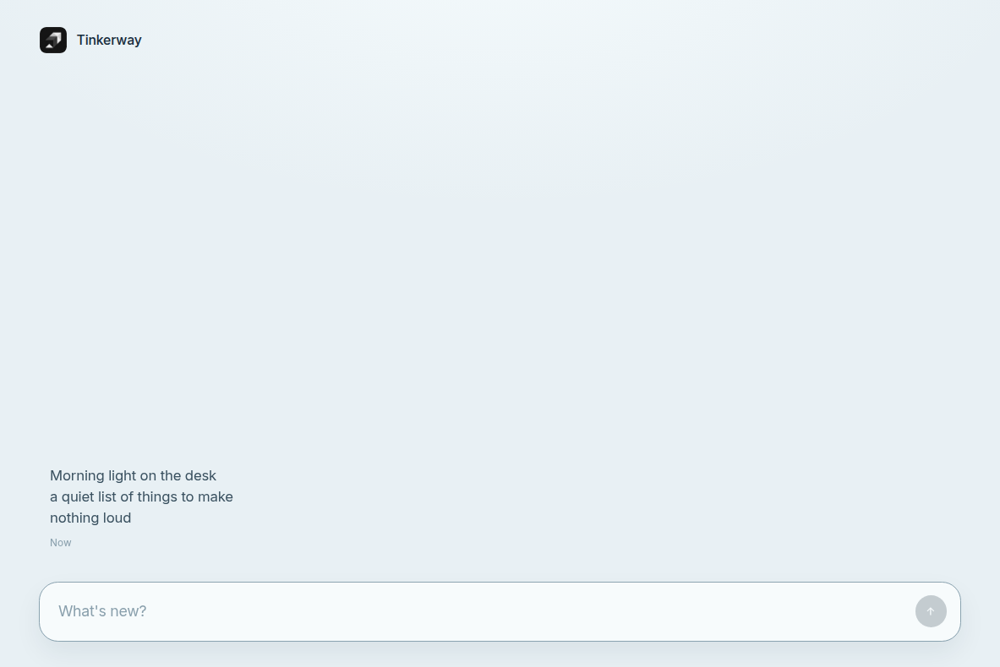

# tinkerway-tauri

**Demo v1 capture** on [Tauri 2](https://v2.tauri.app/): a messaging-shaped feed for private thoughts — compose at the bottom, sent items stack and scroll above. Capture only (no replies, folders, or tags). Same encrypted vault (`tinkerway-vault`); the master key stays in Rust and never reaches the webview.



How to run:

```bash
mise install
MBX_DISABLE=1 cargo run -p tinkerway-tauri
```

- Window ~1200×800: brand header, scrollable feed, growing compose + arrow Send.
- **Enter** sends; **Shift+Enter** newline. Draft stays off the feed until Send.
- Long rows clamp to ~3 lines; click opens a read-only modal titled with the item's timestamp (**Esc** / close).
- Commands only; the webview never receives the master key.

Architecture: [`docs/architecture.md`](../../docs/architecture.md). Privacy: [`docs/data-and-privacy.md`](../../docs/data-and-privacy.md). Capture UX: [`docs/notes-ui.md`](../../docs/notes-ui.md).

## Run (macOS)

Keychain + vault under `ai.tinkerway.app` (`vault-master-key`, Application Support vault). You need a normal Mac desktop WebView stack.

```bash
mise install
# mr-boxington can drop Tauri ACL permission files from the cache — disable for this crate.
MBX_DISABLE=1 cargo run -p tinkerway-tauri
```

Optional (hot reload / CLI helpers):

```bash
cargo install tauri-cli --version "^2" --locked
MBX_DISABLE=1 cargo tauri dev --config apps/tinkerway-tauri/tauri.conf.json
```

## Run (Linux / Cursor cloud VM)

Install WebKitGTK and related system deps, plus the same keystore story (`libsecret` / gnome-keyring or XDG `master-key` fallback):

```bash
sudo apt-get update
sudo apt-get install -y \
  libwebkit2gtk-4.1-dev libgtk-3-dev libayatana-appindicator3-dev \
  librsvg2-dev patchelf libdbus-1-dev libsecret-1-dev \
  pkg-config build-essential
```

Then:

```bash
mise install
MBX_DISABLE=1 cargo run -p tinkerway-tauri
```

CI on Ubuntu runs `cargo test -p tinkerway-vault` and `MBX_DISABLE=1 cargo check -p tinkerway-tauri` (WebKitGTK link deps installed; full GUI smoke is local / Mac).

## Demo path

1. Type in **What's new?** (**Shift+Enter** = newline; field grows). Draft stays off the feed until Send.
2. **Enter** or the arrow — thought appears above; field clears.
3. Click a clamped row → full text in a modal with the timestamp; **Esc** / × closes.
4. Feed scrolls when full; compose stays at the bottom.

## Workspace note

- Ship crate: `apps/tinkerway-tauri` (this package).
- Vault: `crates/tinkerway-vault` (no UI types).
